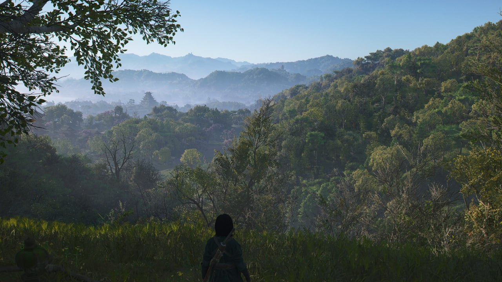
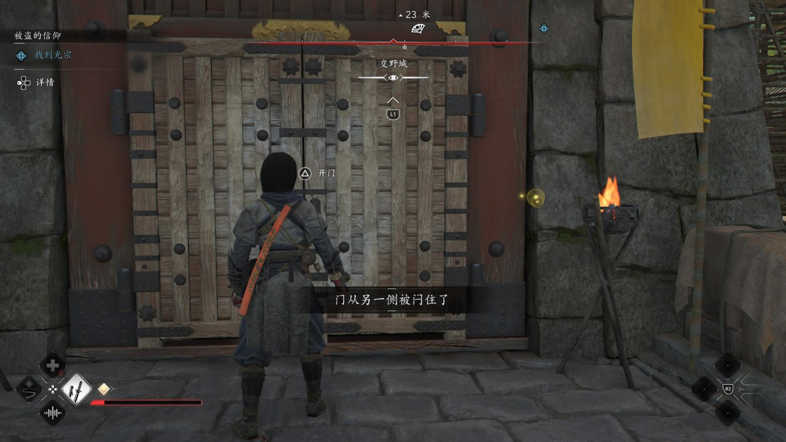

# 刺客信条影 4/10

**时间：2025-06-05 10:23:50**

刺客信条影 4/10 死妈lgbt要谋杀我

  这是我玩的第一部rpg刺客信条，我一直很抵触的暗杀不能直接杀精英怪的机制叠了几个像是从天赋树里拆出来的装备词条就解决了，勉强能玩

    据点是没法清干净的，俯瞰点被放在怪堆中心不杀人没法同步，但同步完第二次来这个俯瞰点的时候你又会发现怪刷新了导致玩家根本没有把怪杀完的欲望。保底金装的箱子就放在俯瞰点旁边但是不把据点里的精英怪杀完你是不准开这个箱子看里面什么词条谁的装备的，非常脑弱。

  提到探索了就不得不提一嘴这部刺客信条的所有剧情npc等都是要你自己跑图按扳机鹰眼视角探索的，游戏ui只会给一个大概方位，比如这人在河北，在廊坊南边，在雄安新区上班，剩下的就需要自己跑图或者让探子扫图，最后实际找下来发现人其实在北京，非常反直觉。疑似育碧被骂满图清问号后加这种机制来报复玩家。藏身处的资源设置也很脑弱但是懒得骂了自己一玩就知道。

  剧情是纯正的一坨大粪，嗯塞个黑鬼就不说了，女主爹开局就被杀了为了复仇才去干新政府的结果干着干着开始搞强制原谅了。最搞的是黑鬼就是屠女主村的罪魁祸首，原谅完黑鬼后中期查到某个boss是黑鬼喜欢的人所以女主必须连这个boss一起原谅，让人不禁怀疑这剧情是做jrpg的日本狗写的。

还有音乐，很难想象这游戏的战斗音乐是日式黑鬼嘻哈说唱

历史感甚至不如浪人崛起啊！！！

