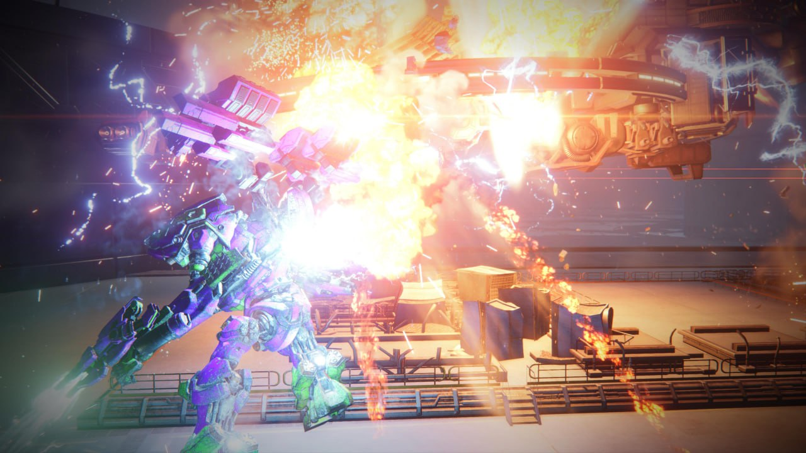
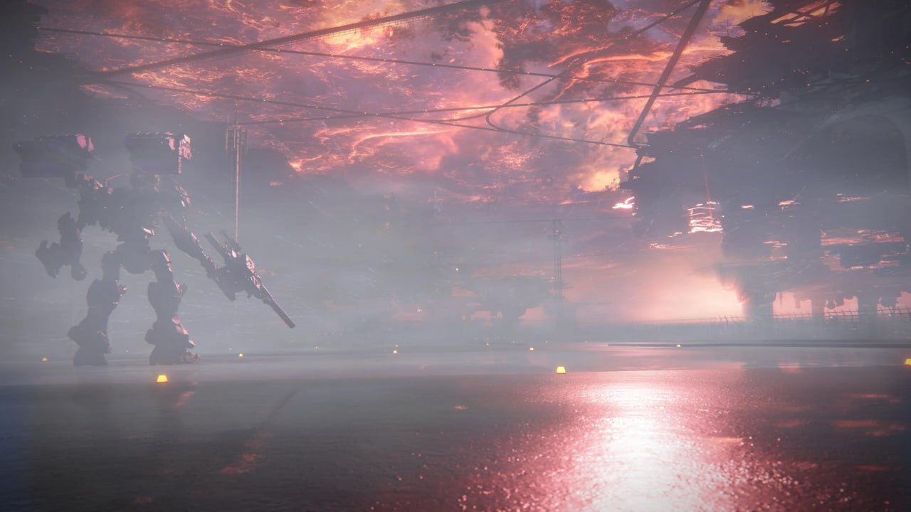
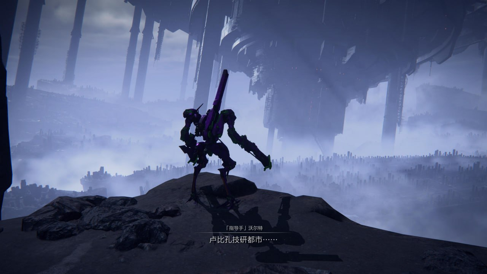
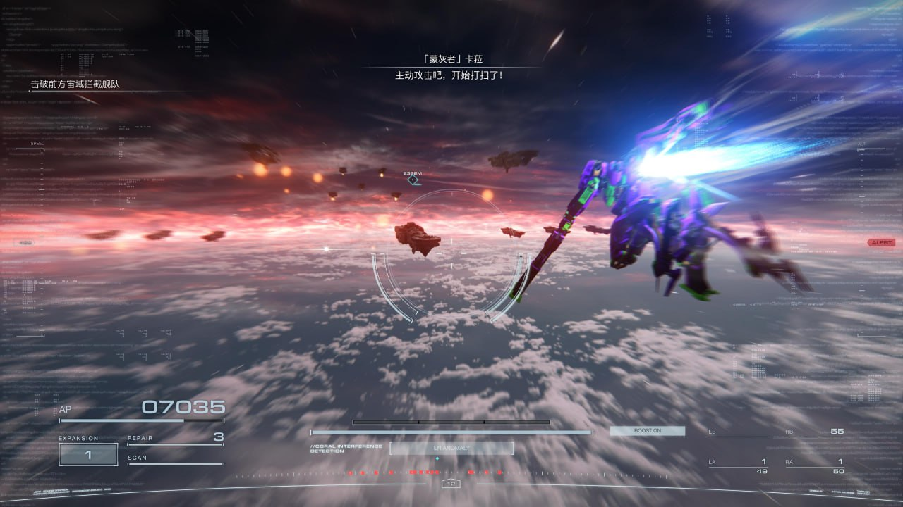
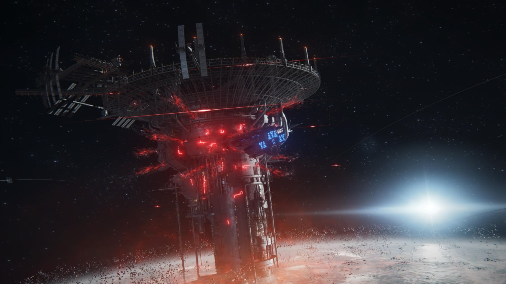

# 装甲核心6 7/10
 魂味很重，读指令马拉松群殴一个不少。看着是个tps射爆游戏玩下来更像动作游戏，个别boss飞过来砍我的那一瞬间我看到了很多故人的影子。
     战斗方面花头看着很多又是激光炮又是这那的，实际上强力的就那么几件，近战不近战远程不远程。打怪看的更多是数值而不是操作，我用初始配装打第一关守门boss卡了两小时，结果打完还有个大boss等着我让我不得不重开游戏摇我最看不起的轮椅进行数值碾压，说别的配装能不能玩吧倒也能玩，但就是不舒服，不装坦克履带就是脆就是被两炮打红驾驶条，用心配半小时装打得还不如开坦克舒服非常消磨热情，尤其是配装还要钱，一套好点的发动机加核心就得一百万而我一周目玩下来流动资金也就150万左右，别的钱要买特定配装打特定敌人，还是数值问题。虽说买的部件能原价卖但还是麻烦，尤其是保存好的配装如果把其中一个部件卖了就再也不能读取这个配装，系统只会提醒缺少必要的部件但不会提醒你缺的是什么，一个机甲十个部件部件名称也完全不说人话，不特意记着绝对想不起来缺的是哪个，也不能先把已有的装备上去，完完全全的鸡肋。
    剧情就那样吧可有可无的，全员谜语，我能猜到主角身份可能是ai或者coral啥的但完全没有探究的欲望，主角作为一个雇佣兵在三个阵营里随便选一个站然后杀另外两个阵营的人，完事另外两个阵营说我相信你不是坏人于是也雇佣我杀别的阵营的人，有一种浪人崛起般的割裂感。前期还有个傻逼部队一直管玩家叫废物另一个傻逼部队有人爱管玩家叫也狗，后期让我从这俩部队的指挥里挑一个杀我毫不犹豫选了管我叫废物那个杀因为我完全想不起来管我叫也狗的那个名字是什么，结果进任务了开始塑造人物弧光了搞得我杀也不是不杀也不是，但那个任务本身做得很死妈打得我火气上来了所以还是杀了。
    美术方面很顶，虽然我说配装没用但还是配了不少拿来拍照，机甲风格好像分什么日式美式的，都很好看就是了，没啥场景叙事房屋基本是ns画面水平但摆着还是很有感觉。
    虽然我闹这么一段看起来很恨，但是一周目体验还是不错的，推荐游玩

