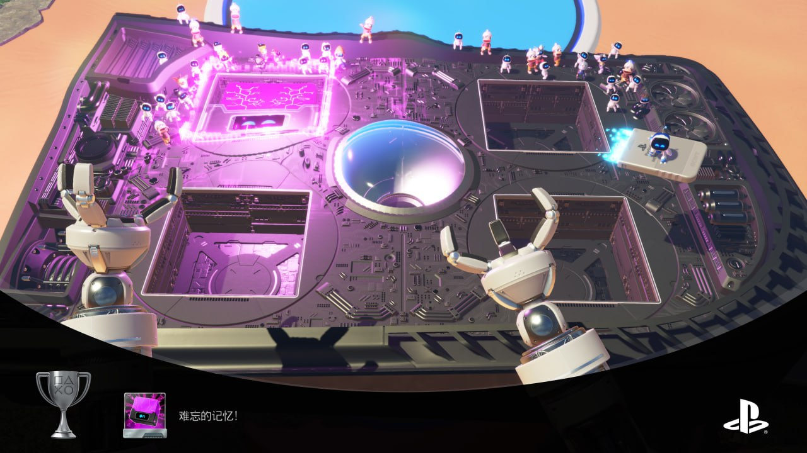
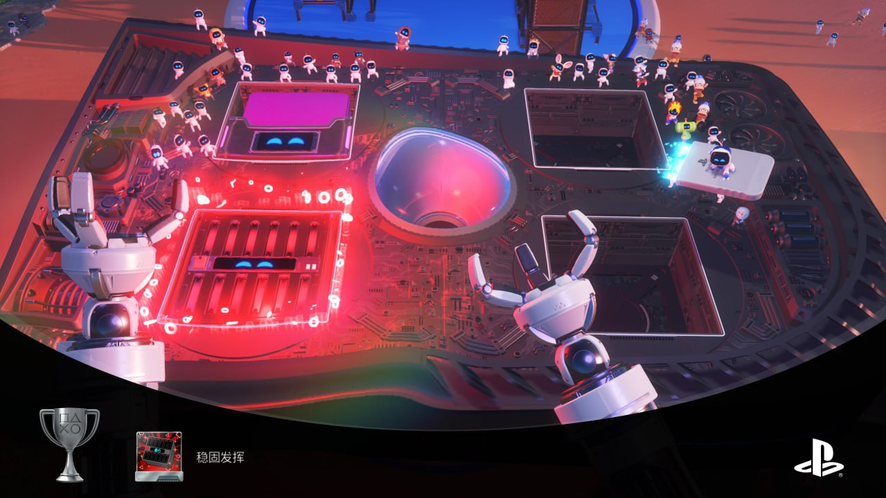
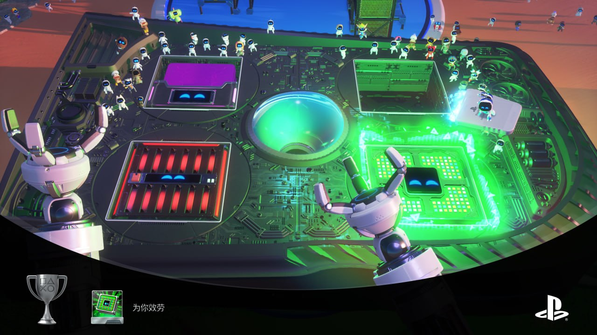
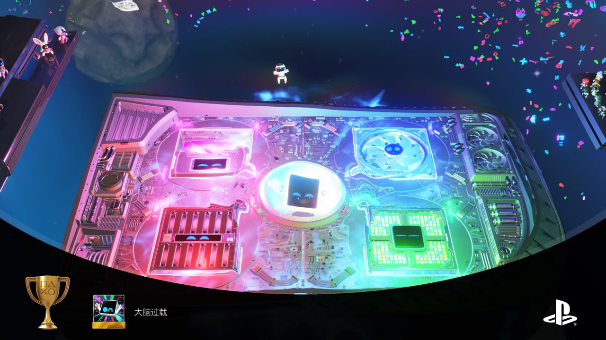
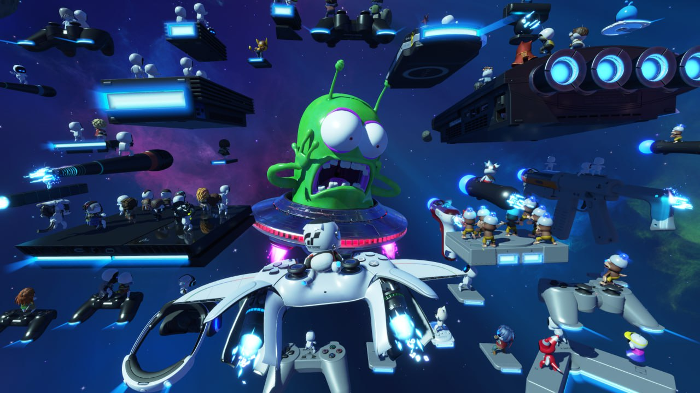
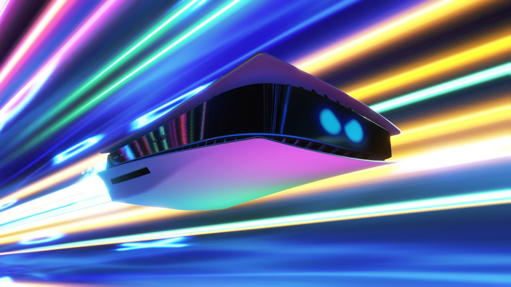
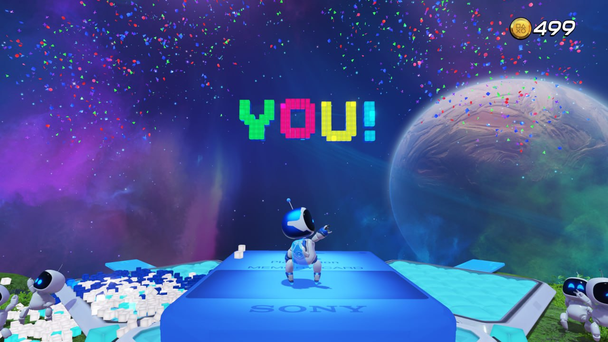

# 宇宙机器人 7/10

**时间：2024-10-02 10:15:15**

画面挺不错的，就玩个手柄震动，上手难度没马里奥奥德赛高，有很多我认识的特殊机器人但不认识的更多，可能从小玩索尼游戏的能认出来不少
奖励关卡只有神秘海域是我玩过爱玩的，变球那个虽然没玩过但是体验挺好，剩下的也就那样
最终boss战给我一种“要是我小时候能玩到这种游戏该多好”的感觉，开始怀念我曾经短暂拥有的未拆封ps4了
468的游戏通关只要10几个小时，有点幽默在里面的

其实应该有9分的，但圈叉三角方块太恶心了，通关后来补这几关差点给我打红温了，果断放弃白金计划

