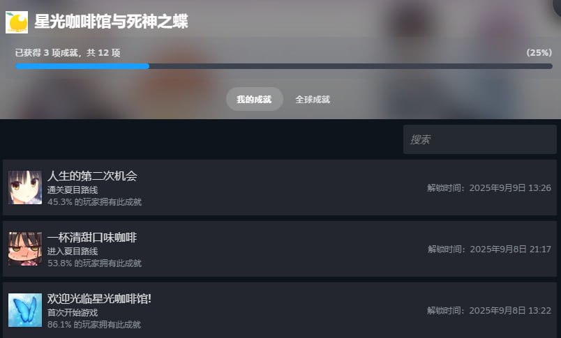

# 星光咖啡馆与死神之蝶 8.5/10

**时间：2025-09-09 17:25:01**

    这种主线纯日常谈恋爱的我还是第一次玩，体验意外地好。在此之前我玩的不是万华镜那种打胶式后宫作品就是三色绘恋命运石之门之类纯叙事的，所以这应该也能算我玩的第一部正经galgame？
    玩这个是因为短视频平台刷到了四季夏目的cosplay，一看到这种正经女仆装我就走不动道了所以在当天晚上就狠狠地购入了顺便还能用上信用卡送的境外支付减5刀券，但因为有圣光懒得下补丁于是放了好几天才打开结果一发不可收拾连着两天给这游戏打完了。跟我想象的所有女主都喜欢男主必须要选一个来谈而且没被选上女主还要流泪祝福的情节展开不同这个游戏在前中期就是很正常的日常讲故事，二次元常见展开之变身打工战士铺垫几个能谈的女主故事背景然后在日常故事中做出选择并以此来决定能攻略谁，虽然我玩的时候没反应过来所以只挑对咖啡馆有益选项的导致进入单身结局，直接粉碎了我对galgame的刻板印象。
    然后再说个人线，我只打了四季夏目的，绝对的10/10，这种高攻低防的角色简直让我的二次元之魂熊熊燃烧，虽然大家都在说傲娇已经退环境了我也是比起明日香更喜欢绫波丽的那种但我还是玩得很开心，四季夏目在傲娇的同时保留了绫波丽的那种性冷淡，进入个人线后用内容翔实有理有据的过去给了玩家充足的理由来包容她前中期的性格，让我不禁想起加持良治曾说过眼角有痣的女人注定一生要不断流泪。
    男主的表现也很牛逼，我说白了我要有男主这种行动力意志力还窝在这推galgame干嘛说不定游戏都不打了，反过来说男主这种不性无能有行动力的人设我在类似二次元作品里真没见过，有点没有代入感了。
    cg更是牛逼中的牛逼，与二次元之魂一起熊熊燃烧的还有我的性压抑之魂，不亚于高中那会下载完美少女万华镜5挂半小时ctrl到结局减产战果发现莲华蹲在浴缸上摇起来的震撼。
    作为我的第一部galgame我很满意，为什么8.5呢我也不知道，打完后自然而然蹦出来的这个分数，并没有经过大脑思考。

