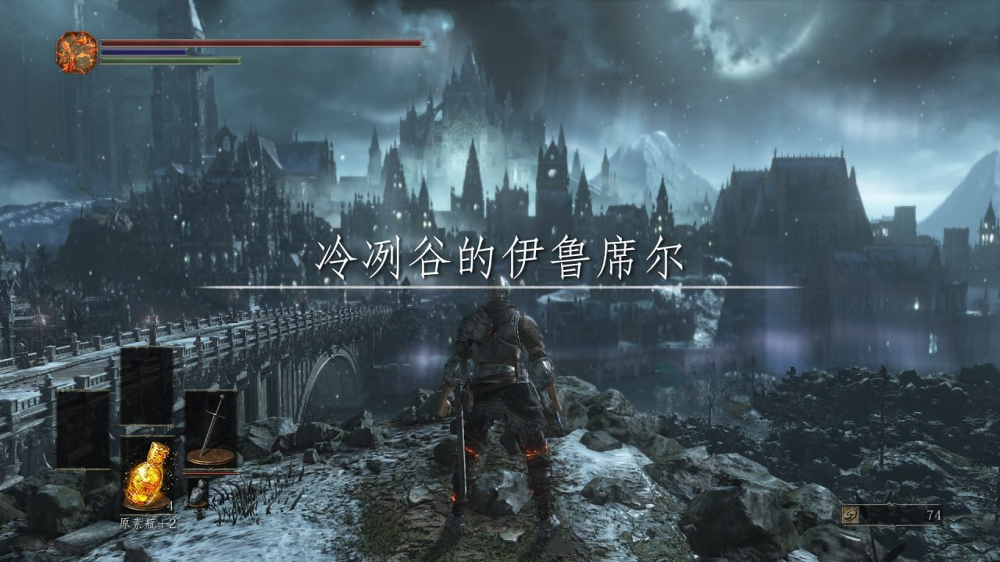
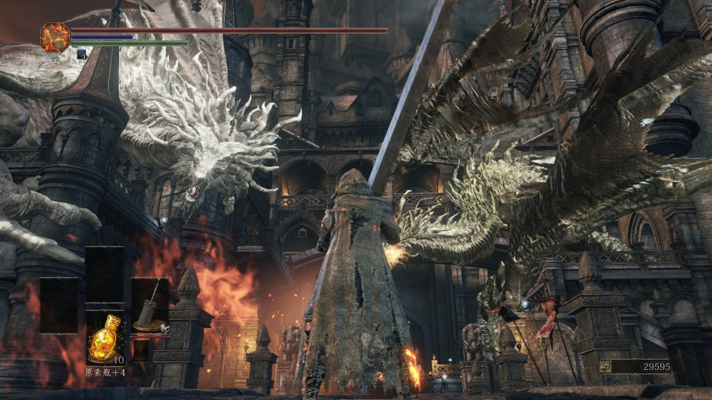
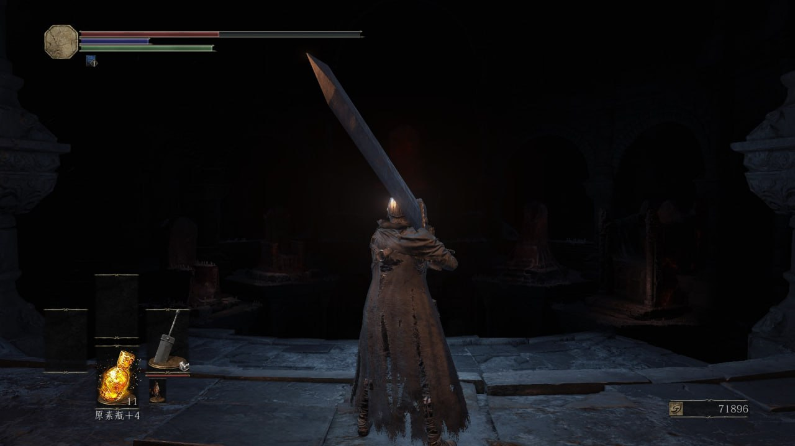
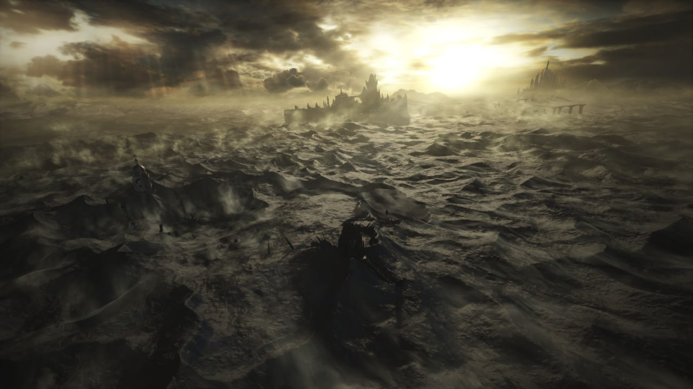
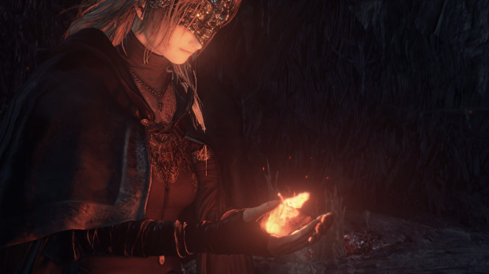

# 黑暗之魂3 6.9/10
  玩了这个游戏我反而搞不懂所谓魂味了，感觉地图还没以前玩的类魂好，从高墙到地下监牢跑图都很折磨没觉得有探索感，打巨人尤姆那段更是没头苍蝇一样乱转惩罚高奖励少，很多地方就算开了捷径也让人觉得没用，进了洛斯里克城才稍微有点血源的感觉，dlc1纯粹脑残做的dlc2给人的印象除了盖尔很牛逼就是一个打不死的射光线傻逼一边跟激关枪似的滋你一边掉帧，让人非常恼火
  但是这个游戏有一点好氛围很到位，美术音乐场景设计2016年顶级现在也不赖，走到熄灯的传火祭祀场我鸡皮疙瘩都上来了，这是别的游戏做不到的

  

