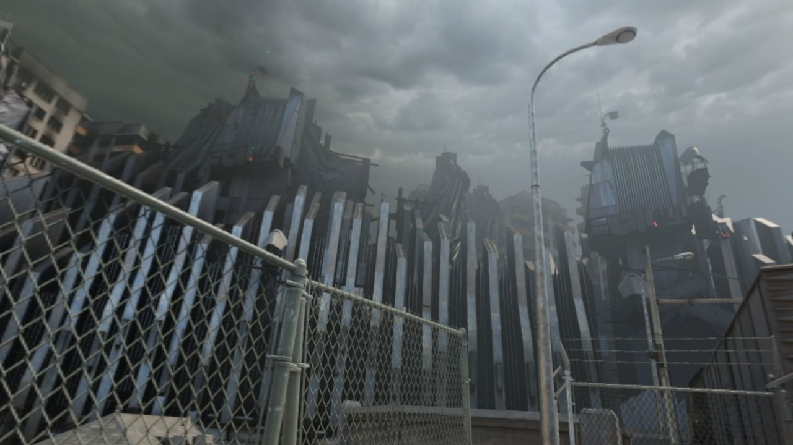
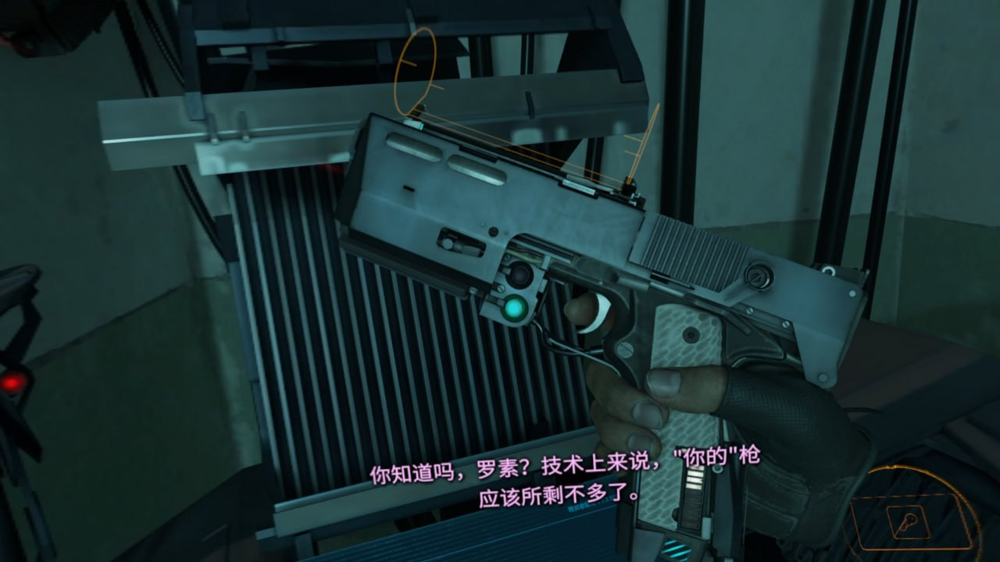
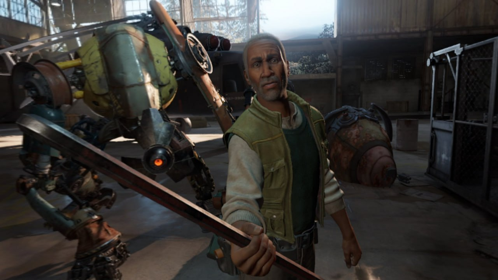

# 半条命alyx  7.9/10

**时间：2025-10-13 10:02:50**

    没我想象中的牛逼，说是划时代的大作但玩下来还是老半条命里走路打枪那一套，基本就是 遭遇战→解密过门→捡垃圾→五句话的剧情推进，很多人说恐怖但我玩下来一点也不恐怖，唯一被吓到是倒数第二章的jumpscare。不过循声者那章做得还是不赖的，就是我老掉帧，不知道这优化到底好在哪了。
    闹得最麻的大部分物体都能互动就像老半条命里大部分物品都能按e捡起来一样，只是能捡起来而已，甚至不能拿玻璃瓶给防卫军开瓢。
    剧情补了点一二代之间的故事，没有戈登弗里曼没有gman老板没有主线推进甚至也不知道说的剧情超级武器到底是什么，还开个新坑说半条命2第二章里死掉的爹又因为跟gman交易被救活了，代入感基本为0，玩完只觉得空虚
    如果这就是vr游戏最高的山...

