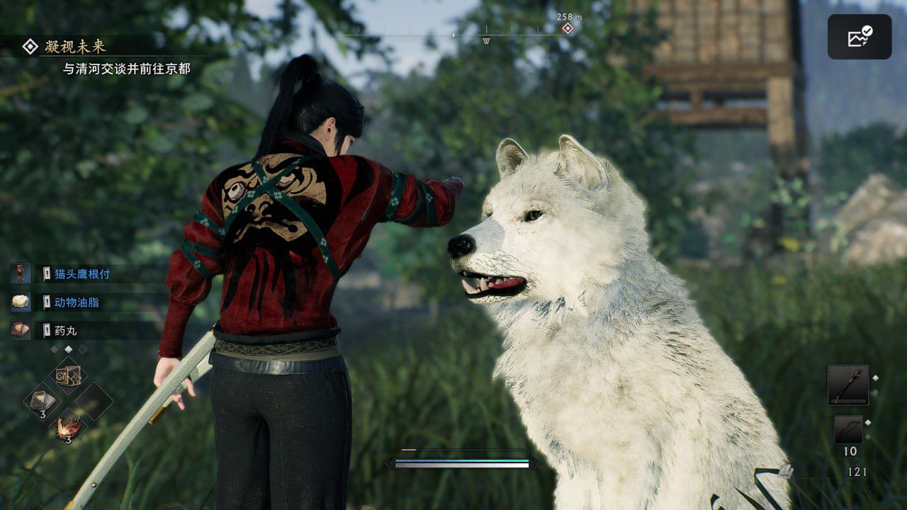
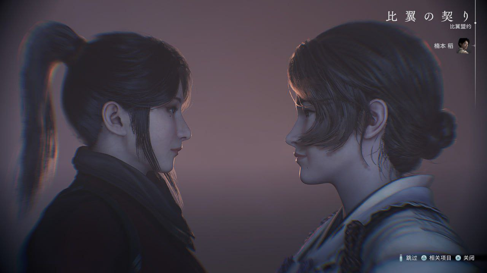
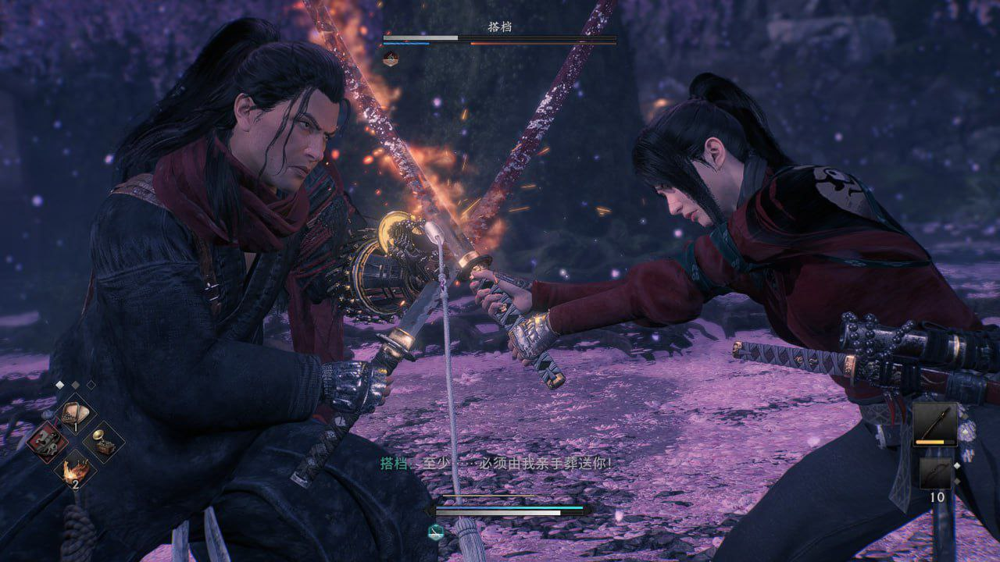
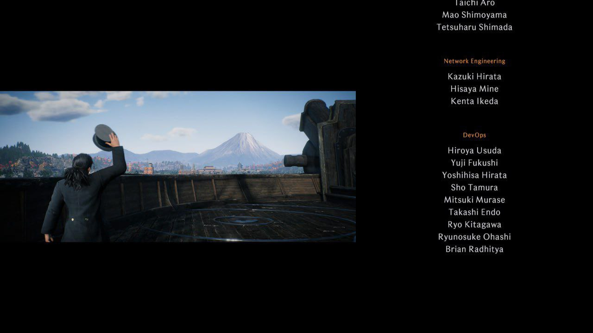

# 浪人崛起 7.4/10

**时间：2024-11-17 13:42:47**

第一章玩的是很上头的，作为一个开放世界不仅有自动寻路跑图还快，战斗系统好玩到完全不会觉得清据点枯燥，半年前没玩下去的原因大概是上来就选了个极难难度搞得弹反判定很严让人没有继续的欲望

但是第二章开始就有点狗屎了，过第一章剧情的时候还在寻思我擦这不比育碧那个日本黑鬼刺客信条做得好，简直就是老刺客信条的精神续作，到了第二章突然搞个对立很强的阵营系统，上一个任务还在杀洋鬼子下一个任务就要杀排外爱国傻逼，前脚把你老师杀了后脚又要跟你合作，甚至我把你老公害死了还能顺便跟你发展个特殊关系，毫无代入感。人物coop更是跟搞刻板印象似的谁要杀鬼子谁要学习新思想，搞完给点垃圾当奖励，合着开放世界的优质奖励只够塞满第一章的。后期boss设计也是狗屎中的狗屎，人均快慢刀霸体无前摇硬控连段大师，搞得战斗系统突然不好玩了，我玩你流派的时候怎么没有这么牛蛆呢

而且一想到这帮日本人厚米跟洋蛆学聪明后的第一件事是搞个大陆政策出来就很难绷，大政奉还萨长同盟什么的跟高中历史课似的过过就完了，玩的时候只会想这个蛆搞甲午海战的那个狗搞军国主义的，一点都不刺客信条

为什么给7.4呢因为我剑星给了7.5

