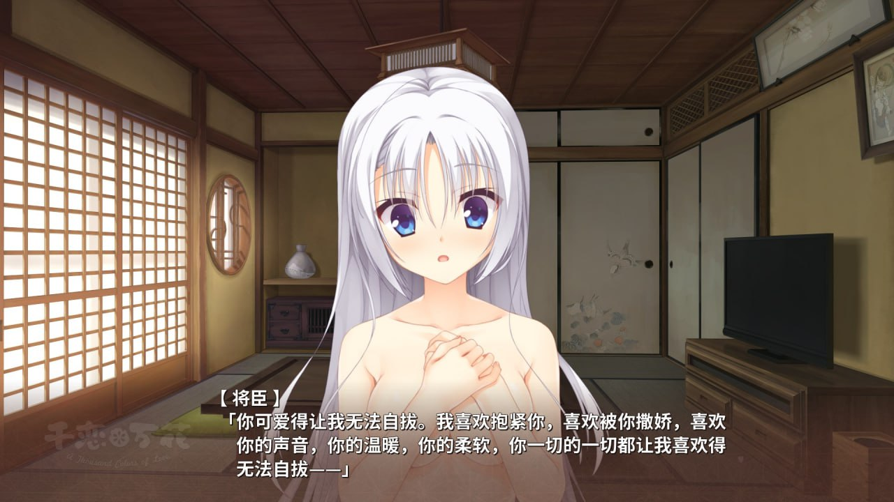
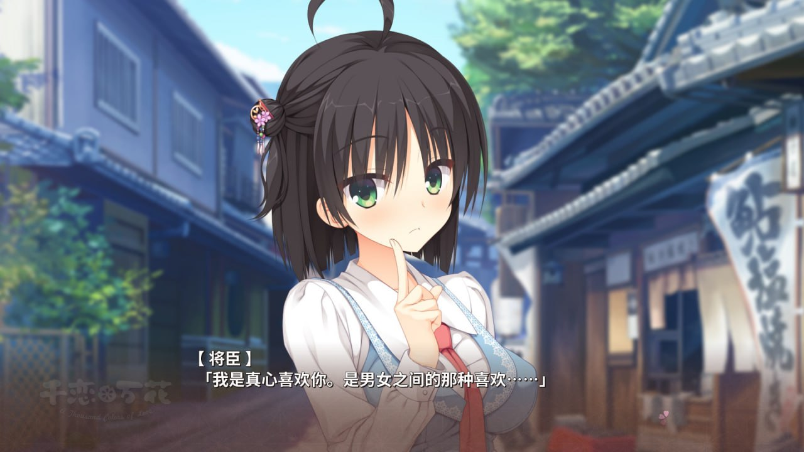
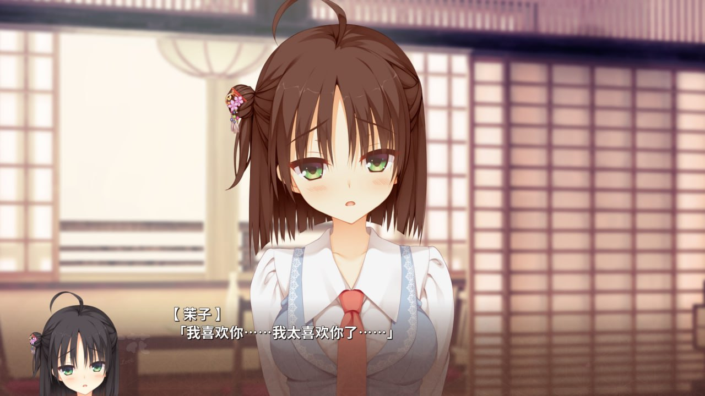
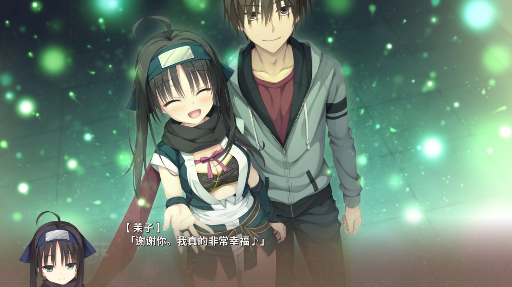
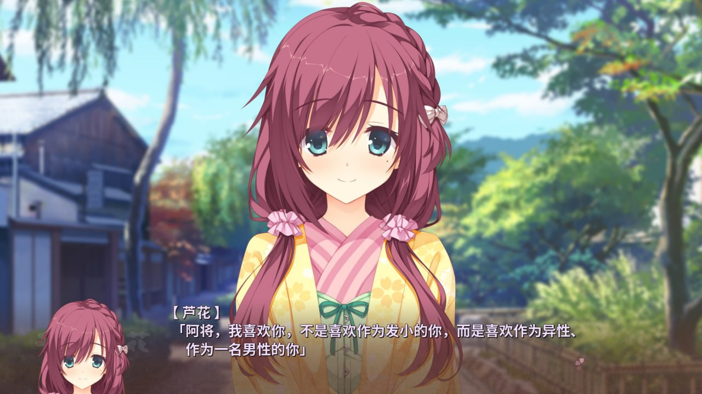

# 千恋万花 6.9/10

**时间：2025-11-22 18:55:13**

    有咖啡馆这种珠玉在前实在很难给这部作品给出高分评价，虽然这两部剧情都非常白开水但咖啡馆至少给男主了一个迷茫找工作的毕业大学生人设让我能非常轻易地代入，而这一部的男主好像是来搞乡村振兴战略的，共通线的屠狗过于超自然让人完全没有代入的欲望。
    个人线打了三个，作为超正牌的白毛线就是莫名其妙进去莫名其妙完结，打完就忘了为什么喜欢上了为什么表白了然后就生小孩结束了，反倒是茉子线给人一种四季夏目般的体验，也有可能是我单纯喜欢反差萌吧，最对xp的芦花线跟没有剧情似的运营一会甜品店就开干结束，甚至后日谈也只是多做一次爱没有任何成长。
    说到做爱又不得不谈本作cg了，白开水到根本打不出来的程度，出cg的方式也更是神，聊着聊着男主突然想插了就说我想跟你做爱然后开干，除了茉子线有点起承转合别的实在僵硬无比，完全没有四季夏目那种水到渠成的感觉。就算是茉子线也能搞出睡在好姐妹旁边来性欲了直接下面脱光自慰出声的神人剧情，想象一下跟你从小玩到大的好兄弟谈了恋爱所以在你旁边把内裤脱了导管，非常难绷。
再也没有四季夏目这样好的galgame女主了！！

