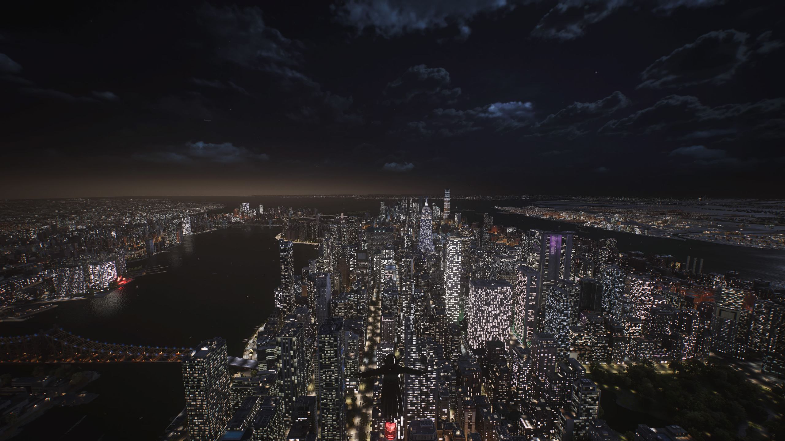
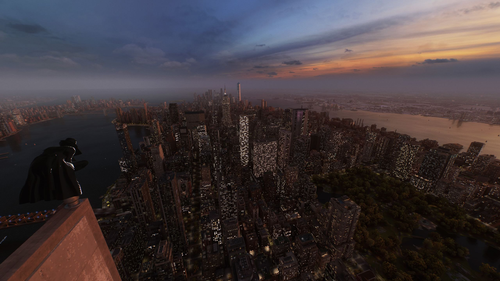
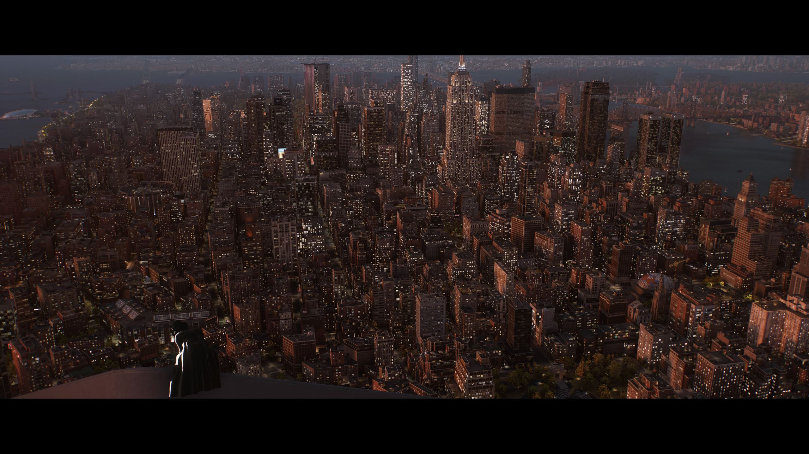

# 漫威蜘蛛侠2 7/10

 三分全扣给剧情 学院支线那几个狗草的 一个喊我拍照不给我地点让我全学校飞 还有一个男同使唤我翻牌子 做得恶心
主线更是他妈的俗 有一种不求无功但求无过的烂 看开头就能猜结局，Peter的幽默感比起上一部差了很多，感觉不如迈尔斯主导剧情发展
还有这个哑巴黑妹，疑似有点为了政治正确硬塞了，毫无戏份，但主线是通篇的烂所以我不好说，不过支线让我体验聋哑人生活做得还行，能让我印象深的支线就一个这个一个放生鸽子

除此之外全是优点 能把跑图做得这么好玩的也就这种超级英雄游戏了，风景也是一绝，而且还能无缝传送，怎么别的跑图费劲游戏不做这个无缝传送呢

