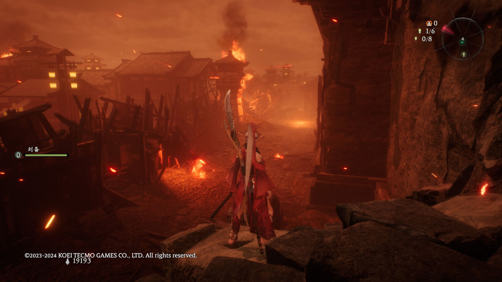
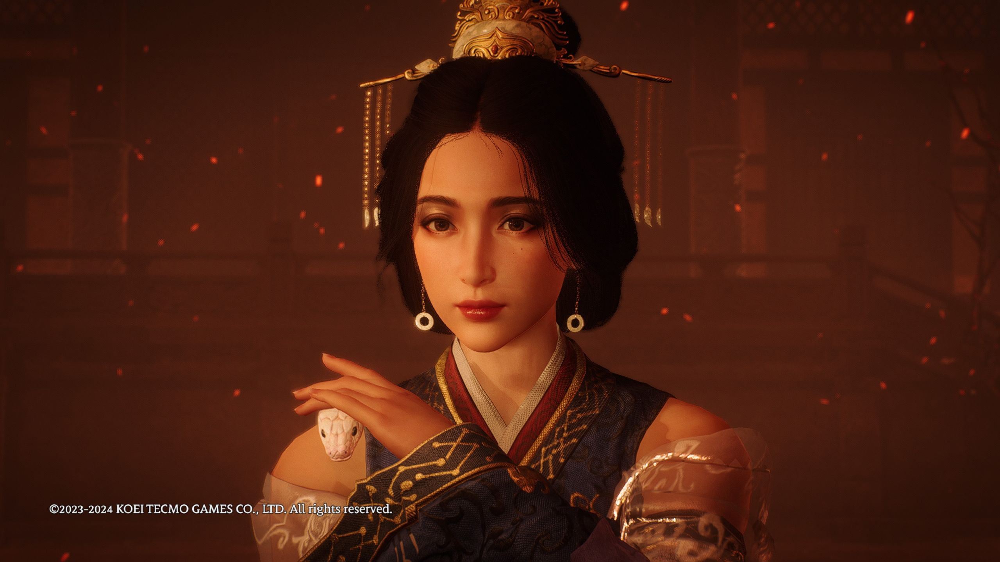
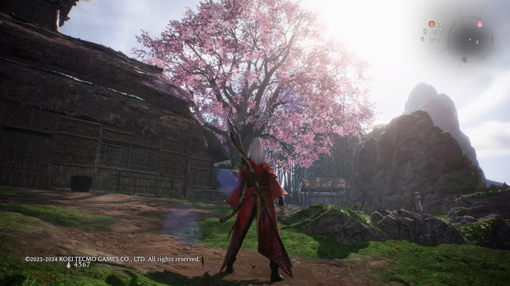

# 卧龙：苍天陨落 7/10

**时间：2024-08-05 11:15:11**

卧龙通关了，虽然我打的很爽但这游戏确实在折磨我，说他没关卡设计吧他还真有，但后期的地图又在折磨人，很难理解日本人为什么要把全图做成不同色调的红然后放个卡视角的大红怪让他丢红色特效的特殊攻击

战斗做的挺好，但对我来说属于剑星那种玩到后面感觉无聊的类型，因为很多武器我都不爱玩

剧情玩几十个小时也没什么代入感的，工具人主角哪有架打往哪跑。虽然登场人物都是三国的但是改编成分太大了搞得我也不太想深思他们之间的关系

不过妹妹做的是真好看，比白皮猪游戏的好看多了，还有情侣装穿，7/10吧

